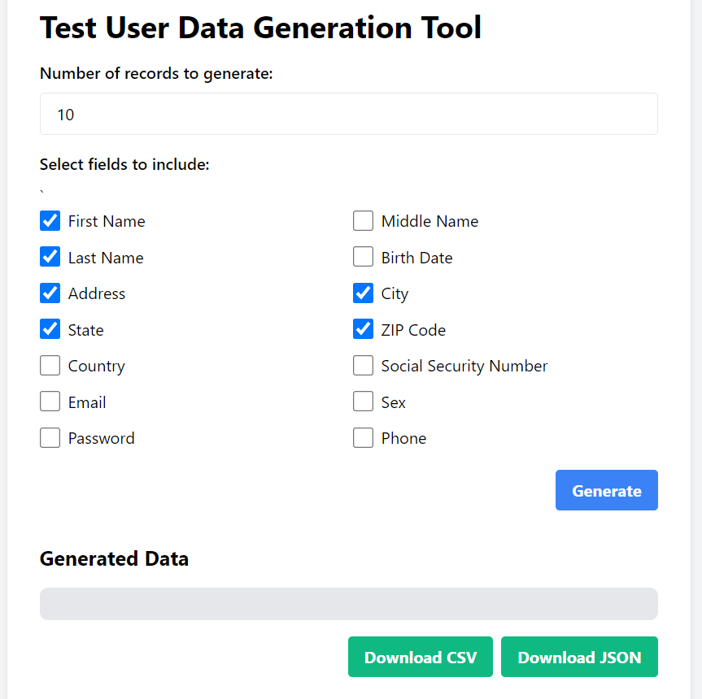

# Test User Data Generation Tool

## Overview

This tool generates test user data for use in development and testing environments.

## Features

* Generates realistic user data, including names, addresses, phone numbers, and email addresses
* Supports customizable data formats and output options - csv and json
* Can generate data in bulk for large-scale testing scenarios

## Usage

To use this tool, simply open the index.html file in your web browser and follow the on-screen instructions.

## Screenshot

Here's a screenshot of the tool in action:

## Try it out!

You can try out the User Data Schema Generator by visiting the [live demo page](https://valiantsin2021.github.io/test-user-data-generator/).

## Contributing

Contributions are welcome! If you'd like to contribute to this project, please fork the repository and submit a pull request.

## License

This project is licensed under the MIT License.